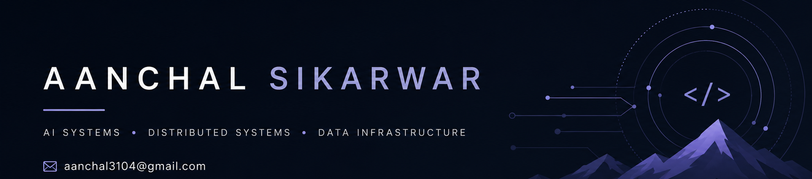

<div align="center">



### `> Building intelligent systems, one distributed node at a time_ `

<br/>

[](https://readme-typing-svg.demolab.com?font=Fira+Code&size=16&pause=1000&color=6EE7B7&center=true&vCenter=true&width=600&lines=AI+Systems+%F0%9F%A4%96+%7C+Distributed+Systems+%E2%9A%A1+%7C+Data+Infrastructure+%F0%9F%97%84%EF%B8%8F;Vector+Search+%F0%9F%94%8D+%7C+RAG+Architectures+%F0%9F%A7%A0+%7C+LLM+Infrastructure+%F0%9F%9A%80;Debugging+is+my+favourite+coding+sport+%F0%9F%8F%86)

<br/>

[](https://github.com/Aanchal2004)
[](https://medium.com/@aanchal3104)
[](https://www.linkedin.com/in/aanchal-sikarwar-711223258/)

</div>

---

## Who  am I?

```python
class Aanchal:
    role        = ["SDE Intern @ Amazon", "Ex-AMTS Intern @ Salesforce"]
    interests   = ["AI Systems", "Distributed Systems", "LLM Infrastructure",
                   "Recommendation Systems", "Vector Search", "RAG"]
currently   = "Exploring LLMs, RAG & distributed data systems 🧠⚡"
writing_at  = "https://medium.com/@aanchal3104"
    fun_fact    = "I debug  for fun... yes, voluntarily 🙃"
```

---

## 🛠️ Tech Stack

#### Languages


#### 🤖 AI / ML


#### ⚡ Data & Distributed Systems


#### 🎨 Frontend (yes, I do those too sometimes)


---

## 🌱 Current Focus

```
┌─────────────────────────────────────────────────────────┐
│  $ ls current_obsessions/                               │
│                                                         │
│  📡  distributed_systems/    → making chaos feel ordered│
│  🏗️  ai_infrastructure/      → GPUs don't pay for itself│
│  🔍  rag_architectures/      → retrieval done right     │
│  🧲  vector_search/          → embeddings go brrr       │
│  🔧  backend_system_design/  → the art of not crashing  │
└─────────────────────────────────────────────────────────┘
```


## ✍️ Latest Writing

> *"If you can't explain it to a distributed system, you don't understand it yet."*

📖 Check out my technical deep-dives on AI systems and intelligent architectures at **[medium.com/@aanchal3104](https://medium.com/@aanchal3104)**

---

## 📫 Let's Connect

<div align="center">

| 💻 Code | ✍️ Words | 🤝 Network |
|:---:|:---:|:---:|
| [GitHub](https://github.com/Aanchal2004) | [Medium](https://medium.com/@aanchal3104) | [LinkedIn](https://www.linkedin.com/in/aanchal-sikarwar-711223258/) |

<br/>

```
> ping aanchal --topic=ai-systems,distributed,collaboration
> response: 200 OK — always up for a good tech convo 🚀
```

</div>

---

<div align="center">

*Powered by caffeine, curiosity, and an unreasonable love for stack traces* ☕


</div>
